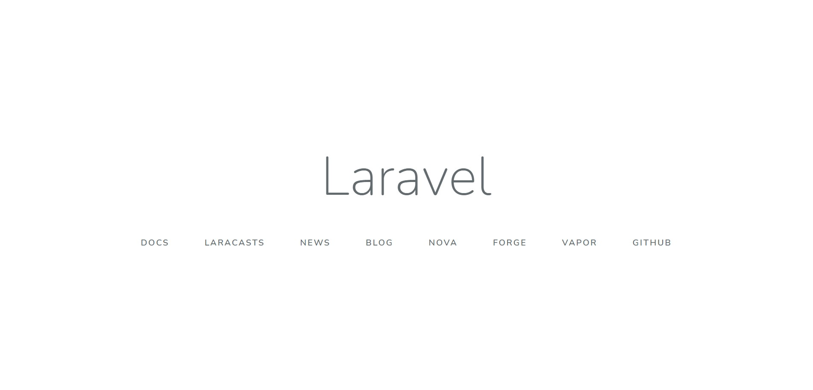

# Docker ComposeでLaraval MySQL環境を構築する

```
$ git clone https://github.com/norik00/Docker-for-Laravel-MySQL.git
```

## ディレクトリ構造
    larabvel/
        ┣ docker-compose.yml
        ┣ app/
        ┃   ┣ Dockerfile
        ┃   ┣ apache/
        ┃   ┃   ┗ 000-default.conf    
        ┃   ┗ php/
        ┃       ┗ php.ini
        ┗ db/
            ┣ my.cnf
            ┣ data/
            ┗ sql/

`data`ディレクトリは自身で作成する

## コンテナ作成
```
$ docker-compose up -d
```

## コンテナ内に入る
```
$ docker-compose exec "container_name" bash
```

storageディレクトリの権限を変更
```
/var/www/html# composer create-project laravel/laravel "dir_name"
/var/www/html# cd "dir_name
/var/www/html/dir_name# chmod -R 777 storage
```

ブラウザで以下画面が表示される


## mod_rewriteを有効
この設定をしないと他のページが表示されません。

`/var/www/html`からrootに移動します。

```
# cd /etc/apache2/mods-enabled
# a2enmod rewrite

Enabling module rewrite.
To activate the new configuration, you need to run:
  service apache2 restart

# service apache2 restart
```

## laravel よく使うコマンド

### コントローラーファイル作成

クラス名`CostController`

```
# php artisan make:controller CostController
```

### マイグレーションファイル作成  

ファイル名`create_costs_table`
テーブル名`costs`

```
# php artisan make:migration create_costs_table --create=costs
```

## マイグレーション実行

```
# php artisan migrate
```

## モデルクラス作成

モデル名`Cost`

```
# php artisan make:model Cost
```

## シーダーファイル作成
テストデータ挿入

クラス名`CostTableSeeder`

```
# php artisan make:seeder CostTableSeeder
```

## シーダーファイルの実行

```
# composer dump-autoload
# php artisan db:seed --class=CostTableSeeder
```

## マイグレーションリセット

```
# php artisan migrate:reset
```

## マイグレーションファイルで`change()`コマンドを使用する場合

`doctrine/dbal`のインストールが必要

```
# composer require doctrine/dbal
```

